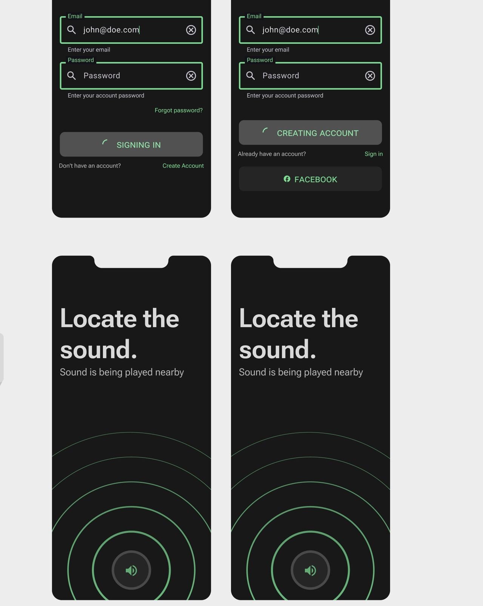

<pre>
The Spatial Audio navigation game & technology showcase. Service generates true 
spatial audio capable of simulating multiple objects and auditory materials and 
surfaces. 

Working on a HRTF generator from 3D scans, inspired by PHRTF by Dolby 
Laboratories. This will allow Echo Trail to be capable of generating 3D model 
from scans and images, and then simulate them in an auditory space to generate 
custom HRTF functions for users then use clever mathematics to generate 
continuous HRTF approximations based on user head and location tracking. 
</pre>

